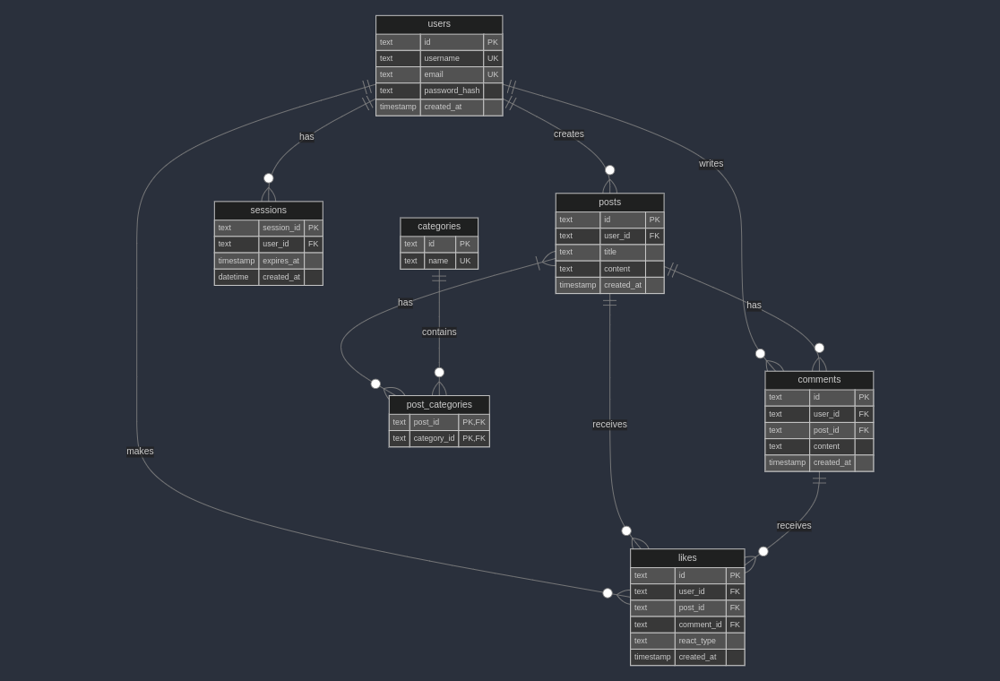

# Forum Project

A web-based forum platform built with Go that enables user communication, post categorization, and interactive content engagement.

## Features

- **User Authentication**

  - User registration with email and username
  - Secure password encryption
  - Session management with cookies
  - Single active session per user

- **Posts and Comments**

  - Create and view posts (authenticated users)
  - Comment on posts (authenticated users)
  - View posts and comments (all users)
  - Associate multiple categories with posts (authenticated users)
  - Like/dislike functionality for posts and comments (authenticated users)

- **Content Filtering**
  - Filter posts by categories
  - View posts created by the logged-in user
  - Filter posts liked by the logged-in user

## Technology Stack

- **Backend**: Go
- **Database**: SQLite3
- **Frontend**: HTML, CSS, JavaScript (Vanilla)
- **Containerization**: Docker

## Project Structure

```
forum/
├── cmd/                  # Application entrypoint
├── internal/             # Internal application code
│   ├── database/         # Database setup and migrations
│   ├── handlers/         # HTTP request handlers
│   ├── middleware/       # HTTP middleware
│   ├── models/           # Data models
│   ├── repositories/     # Data access layer
│   ├── services/         # Business logic
│   └── utils/            # Utility functions
├── static/               # Static assets
└── templates/            # HTML templates
```

## Prerequisites

- Go 1.21 or higher
- Docker

## Getting Started

1. Clone the repository:

   ```bash
   git clone https://github.com/Hamza-El-Azzouzi/forum.git
   cd forum
   ```

2. Build and run with Docker:

   ```bash
   ./script.sh
   ```

3. Access the application:
   ```
   http://localhost:8082
   ```

## Database Schema

<p>
  
</p>
The application uses SQLite with the following main tables:
- Users
- sessions
- Posts
- Comments
- Categories
- Likes
- Post_Categories (for many-to-many relationship)

## API Endpoints

### Authentication

- `POST /register` - Register a new user
- `POST /login` - User login
- `POST /logout` - User logout

### Posts

- `GET /` - List all posts
- `GET /detailsPost/{id}` - Get specific post
- `POST /createPost` - Create new post
- `POST /like/{id}` - Like post
- `POST /dislike/{id}` - Dislike post

### Comments

- `POST /sendcomment/{id}` - Add comment
- `POST /likeComment/{id}` - Like comment
- `POST /dislikeComment/{id}` - Dislike comment

## Development

1. Install dependencies:

   ```bash
   go mod download
   ```

2. Start development server:
   ```bash
   go run cmd/server/main.go
   ```

## Docker Support

The project includes a Dockerfile for containerization. Build and run:

```bash
# Build image
docker build -t forum .

# Run container
docker run -p 8080:8080 forum
```

## Security Features

- Password encryption using bcrypt
- Session management with cookies
- Input validation

## Contributing

1. Fork the repository
2. Create your feature branch (`git checkout -b feature/amazing-feature`)
3. Commit your changes (`git commit -m 'Add some amazing feature'`)
4. Push to the branch (`git push origin feature/amazing-feature`)
5. Open a Pull Request

## License

This project is licensed under the MIT License - see the LICENSE file for details.

## Acknowledgments

- SQLite for database management
- Go standard library
- bcrypt for password encryption
- UUID package for unique identifiers
